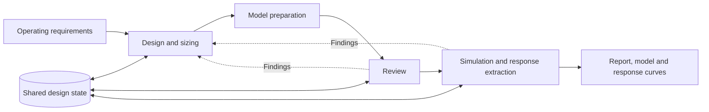

# text2hydraulic
### AI-Assisted Hydraulic Circuit Synthesis and Simulation-Based Verification

Software companion to **text2hydraulic: An AI-Assisted Method for Hydraulic Circuit Synthesis, Simulation-Based Verification, and Industrial Adaptation**.

text2hydraulic turns natural-language operating requirements into hydraulic circuit candidates, engineering calculations, Modelica models, and simulation results. It combines hydraulic-domain knowledge, Design–Review–Simulation agents, a shared design state, deterministic Python tools, and OpenModelica.

[Installation](#installation) · [Run the demo](#run-the-demo) · [Example](#example) · [Method and code](docs/method.md) · [中文说明](README.zh-CN.md)

## Overview



The local workspace provides four panels: requirement input, live activity, the generated circuit diagram, and simulation curves. Reports and generated files can be inspected and exported from the same page.

- **Domain resources:** six circuit-function classes, 30 circuit patterns, and 39 component/model descriptions.
- **Three specialist roles:** Design selects and sizes the circuit; Review checks the current candidate; Simulation prepares and executes the model.
- **Deterministic tools:** nine scripts for conversion, sizing, state handling, validation, layout, and response extraction.
- **Traceable outputs:** shared `memory.json`, model and execution script, simulator logs, available MAT/CSV results, and a final report.

See [method and code](docs/method.md) and the [reference index](docs/reference-index.md) for implementation details.

## Installation

### 1. Environment

Use **Linux**, or Linux under **WSL2**, with **Python 3.10+**. Download or clone this repository and open a terminal in its root directory. The browser interface needs no npm installation or frontend build.

Install these external dependencies:

| Dependency | Purpose |
| --- | --- |
| [Claude Code](https://code.claude.com/docs/en/setup) | Executes the skill and agents using your configured model service |
| [OpenModelica](https://openmodelica.org/download/) and a compiler toolchain | Compiles and simulates generated models |
| Modelica Standard Library | Standard mechanical and signal components |
| [OpenHydraulics](https://github.com/modelica-3rdparty/OpenHydraulics) | Hydraulic component models |
| GNU `timeout` | Bounds simulation commands |

The manuscript uses OpenModelica **1.26.4** and OpenHydraulics **2.0.0**. The demo uses your locally configured model backend. Before starting, authenticate the CLI and verify:

```bash
python3 --version
claude --version
omc --version
timeout --version
```

### 2. Configure OpenHydraulics and the model

Point the demo to your installed OpenHydraulics library:

```bash
export T2H_OPENHYDRAULICS=/absolute/path/to/OpenHydraulics/package.mo
```

Replace the path with the actual location of `package.mo`. Configure the model service and credentials in your CLI environment. To select a particular model exposed by that service:

```bash
# Optional: replace with a model identifier accepted by your CLI.
export T2H_MODEL=your-model-id
```

Without `T2H_MODEL`, the demo inherits the local default model. Persistent settings can be stored in `config.json`; use [config.example.json](config.example.json) as a reference. See [configuration details](docs/setup.md).

### 3. Set up diagram rendering

```bash
# Read-only dependency check.
python3 setup_renderer.py --check

# Explicitly create the local renderer environment and install pinned packages.
python3 setup_renderer.py --install
```

Rendering also needs the Cairo system library and OpenModelica's `generate_icons.py`. If the script is not discovered automatically, set `icon_exporter` in `config.json` to its installed path. Detailed instructions are in [setup and troubleshooting](docs/setup.md).

## Run the demo

```bash
bash start.sh
```

Open **http://127.0.0.1:8766**. For a terminal without browser integration:

```bash
bash start.sh --no-browser
# Optional alternative port:
bash start.sh --no-browser --port 8877
```

1. Open **Environment settings** and verify the runtime and simulator paths.
2. Choose **Worktable**, or enter your own operating requirements.
3. Click **Start design** to run the design, review, and simulation workflow.
4. Inspect the circuit diagram and select a CSV signal in the response panel.
5. Use **Read final report** and **Export run** to inspect and save the outputs.

Opening the page makes no model calls. **Start design** uses your configured model service. The default overall run timeout is 30 minutes.

## Example

Paste the following input, also available in [examples/worktable.txt](examples/worktable.txt):

> Design a horizontal hydraulic worktable. Workpiece mass: 500 kg; friction coefficient: 0.15; maximum speed: 0.1 m/s; stroke: 0.5 m; maximum system pressure: 10 MPa. Complete circuit design, sizing, Modelica modeling and OpenModelica simulation. Report actual velocity, stroke coverage and acceptance results.

The workflow records requirements and assumptions, selects components, calculates parameters, constructs the Modelica model, checks the candidate, and attempts simulation. Results are displayed when the corresponding artifacts are generated. Failed runs retain their diagnostics and available files.

For a small calculation that requires neither a model service nor OpenModelica:

```bash
python3 bundle/.claude/skills/text2hydraulic/scripts/calculate_cylinder_diameter.py \
  --force 10000 --pressure 10000000 --speed 0.1 --indent 2
```

The theoretical bore is approximately **35.68 mm** and the flow is **6 L/min**. This is an idealized calculation before standard-size rounding and engineering margins.

See [the demo walkthrough](docs/demo.md) for output files, acceptance fields, visualization, and session resumption.

## Repository structure

```text
.
├── bundle/.claude/
│   ├── agents/                    Design, Review, Simulation
│   └── skills/text2hydraulic/
│       ├── SKILL.md                Workflow and shared-state contract
│       ├── reference/              Circuit manuals, catalog, state template
│       └── scripts/                Nine engineering tools
├── docs/                          Setup, demo walkthrough, method and references
├── examples/                      Example operating requirements
├── static/                        HTML, CSS and JavaScript interface
├── tests/                         Software regression tests
├── scripts/check_repository.py    Source and documentation checks
├── server.py                      Local backend and run orchestration
├── visualization.py               CSV and model inspection
├── icon_preview.py                Diagram jobs and cache
├── render_model.py                OpenModelica icon rendering adapter
├── setup_renderer.py              Renderer diagnostics and installation
├── config.example.json            Portable default configuration
├── start.sh                       Demo launcher
└── package_demo.py                Portable source archive
```

## Development

```bash
python3 scripts/check_repository.py
python3 -m unittest discover -s tests -v
node --check static/app.js
node tests/test_model_selection.cjs
python3 package_demo.py
```

Run the full software tests on Linux. Runtime tests use a fake CLI and do not consume model credits. Node.js is needed only for the JavaScript developer checks. The packager creates `dist/text2hydraulic-demo-linux.zip` with a SHA-256 manifest, excluding local configuration, credentials, run outputs, and virtual environments.

## Acknowledgements

The demo uses OpenModelica, OpenHydraulics, the Modelica Standard Library, and the Python rendering packages listed in [THIRD_PARTY.md](THIRD_PARTY.md).

## Citation

If you use this method, please cite *text2hydraulic: An AI-Assisted Method for Hydraulic Circuit Synthesis, Simulation-Based Verification, and Industrial Adaptation*, and identify the software commit or release used.

This software supports conceptual design and simulation pre-verification. Generated hydraulic designs require engineering review and appropriate physical validation before deployment.
